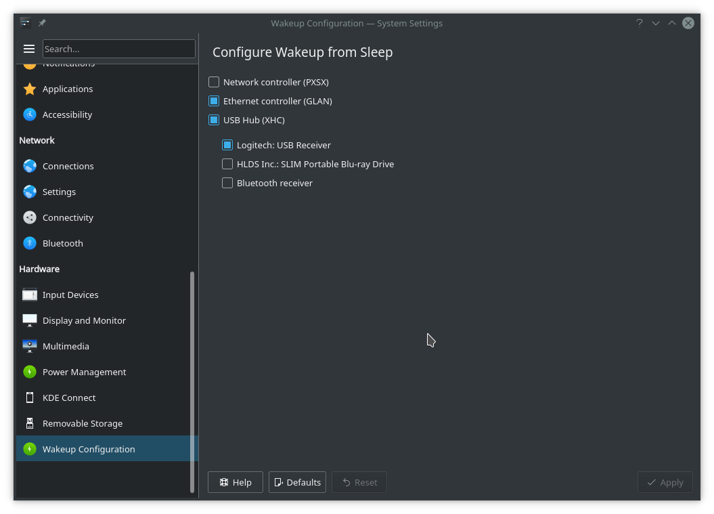

# KDE configuration module to configure Wakeup from Sleep/Hibernate

This module for the KDE system configuration allows to set which devices (e.g. Mouse, Keyboard, Ethernet) wake the computer from sleep or hibernate when activated. It can also be used to prevent some devices which randomly wake up the computer from doing so.
The module shows a hierarchy of ACPI devices and for all USB hubs the dependent devices. Checking a box enables wakeup by that device. Note that for a USB device to be able to wake the computer from sleep requires that the USB hub the device is on also stays awake when sleeping (box must be checked).



### Building
Install the following build dependencies
```
sudo apt install cmake
```

Follow instructions on
https://community.kde.org/Guidelines_and_HOWTOs/Build_from_source/Install_the_dependencies
to install the dependencies. On Ubuntu 18:04 the following appears to be sufficient
```
sudo apt-get install libbz2-dev libxslt-dev libxml2-dev shared-mime-info oxygen-icon-theme libgif-dev libvlc-dev libvlccore-dev doxygen gperf bzr libxapian-dev fontforge libgcrypt20-dev libattr1-dev network-manager-dev libgtk-3-dev xsltproc xserver-xorg-input-synaptics-dev libpwquality-dev modemmanager-dev libxcb-keysyms1-dev libepoxy-dev libpolkit-agent-1-dev libnm-util-dev libnm-glib-dev libegl1-mesa-dev libxcb-xkb-dev libqt5x11extras5-dev libwww-perl libxml-parser-perl libjson-perl libboost-dev libgstreamer-plugins-base1.0-dev libgstreamer1.0-dev libarchive-dev liblmdb-dev cmake git extra-cmake-modules "libkf5.*-dev"
```

Now clone, build and install the module 

```
git clone https://gitlab.com/bkoblitz/wakeupkcm.git
```

Within wakeupmanager do
```
mkdir build
cd build
cmake .. -DCMAKE_INSTALL_PREFIX=`kde4-config --prefix`
sudo make install
```

The module is now available in the KDE system settings as module Wakeup under Hardware.

Test with lots of debug output with
```
kcmshell5 kcm_wakeup
```
